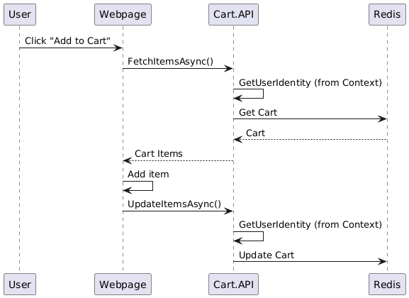

# How to run:
* Install prometheus and add the configuration (from monitoring folder)
* Install grafana and configure the data source to use prometheus
* Run project like normal

# Sequence diagram

Note: only run in Ubuntu linux